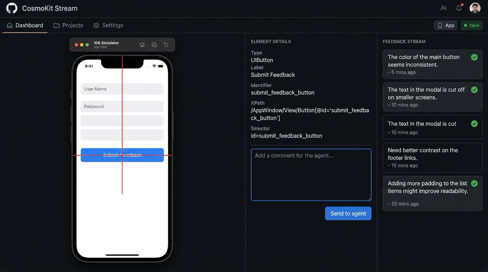

# cosmokit CLI

Scriptable access to the iOS Simulator operations the [CosmoKit](https://usecosmoskittool.com)
macOS app performs, for Makefiles, git hooks and CI.

Boot a simulator, take a screenshot, record a video, set GPS coordinates or
open a deep link, without leaving the terminal.

## Requirements

macOS 13 or later with Xcode's command line tools installed. The CLI shells out
to `xcrun simctl`. It does not depend on the CosmoKit app, and you do not need
the app to use it.

## Install

Build from source. This is the recommended route, and the fastest one on a
machine that already has Xcode:

```sh
git clone https://github.com/maththedev42/cosmokit-cli.git
cd cosmokit-cli
swift build -c release
cp .build/release/cosmokit /usr/local/bin/
```

Or download the universal binary from
[Releases](https://github.com/maththedev42/cosmokit-cli/releases). It is ad-hoc
signed rather than notarized, so macOS quarantines it on download and you have
to clear that yourself:

```sh
tar xzf cosmokit-0.3.0-macos-universal.tar.gz
xattr -d com.apple.quarantine cosmokit
mv cosmokit /usr/local/bin/
```

## Commands

```
DISCOVERY
cosmokit list                        List available simulators
cosmokit runtimes                    List runtimes and device types
LIFECYCLE
cosmokit boot [name|udid]            Boot a simulator
cosmokit shutdown [name|udid]        Shut down a simulator
cosmokit erase [name|udid]           Erase a simulator
APPS
cosmokit apps [name|udid]            List installed apps
cosmokit install <path> [name|udid]  Install an app bundle
cosmokit uninstall <bundle> [name|udid] Uninstall an app
cosmokit launch <bundle> [name|udid] Launch an app
cosmokit terminate <bundle> [name|udid] Terminate an app
cosmokit container <bundle> [kind] [name|udid] Get a container path
CAPTURE
cosmokit capture [name|udid]         Screenshot to a file
cosmokit record [name|udid]          Record video
STATE
cosmokit appearance [light|dark] [name|udid] Set or read appearance
cosmokit statusbar [flags] [name|udid] Set status bar overrides
cosmokit statusbar-clear [name|udid] Clear status bar overrides
cosmokit permission <action> <service> [bundle] [name|udid] Set permission
cosmokit biometric-enroll <on|off> [name|udid] Set biometric enrollment
cosmokit biometric-match [match|nomatch] [name|udid] Trigger biometric result
CONTENT AND INPUT
cosmokit open <url> [name|udid]      Open a deep link
cosmokit push [bundle]               Send a push payload
cosmokit addmedia <path> [path ...]  Add media to the photo library
cosmokit pasteboard [--set <text>]   Read or set the pasteboard
LOCATION
cosmokit location <lat> <lon> [dev]  Set a fixed GPS position
cosmokit scenarios [name|udid]       List built-in location scenarios
cosmokit route <scenario> [name|udid] Run a location scenario
cosmokit location-clear [name|udid]  Clear a location scenario
INSPECTION
cosmokit defaults <bundle>           Read app UserDefaults
cosmokit defaults-write <bundle> <key> <value> Write a default
cosmokit defaults-delete <bundle> <key> Delete a default
cosmokit logs [--last <duration>]    Read a bounded log window
cosmokit keychain <path> [name|udid] Install a trusted or untrusted certificate
cosmokit keychain-reset [name|udid]  Reset the simulator keychain
cosmokit proxy-status                Read the inherited system proxy
cosmokit agent start [name|udid]     Start the XCUITest simulator driver
cosmokit agent stop [name|udid]      Stop the simulator driver
cosmokit agent status [name|udid]    Check driver reachability
cosmokit agent stream [name|udid] [--port 8878] [--open] [--fps 4] [--scale 0.5] Stream simulator to browser for feedback
cosmokit agent stream stop [name|udid] Stop the browser stream
cosmokit feedback next [--wait 300] [--json] Wait for the next human comment
cosmokit feedback list [--json]      List all feedback comments
cosmokit feedback ack <seq>          Mark feedback comment answered
cosmokit feedback clear              Clear all feedback comments
cosmokit ui tree                     Print the compact UI tree
cosmokit ui wait "<text>" [--timeout 10] [--gone] [--interval 0.3] Wait for UI element to appear or disappear
cosmokit ui do <step> [<step>...]        Run a sequence of UI actions
cosmokit ui tap <ref|x,y>            Tap an element or coordinate
cosmokit ui press <ref>              Long-press an element
cosmokit ui swipe <direction>        Swipe up, down, left, or right
cosmokit ui type <text>              Type into the active field
cosmokit ui button <name>            Press a hardware button
cosmokit ui alert <action>           Accept, dismiss, or press an alert button
cosmokit ui screenshot               Capture the current UI as PNG
cosmokit ui find <text>              Find matching UI elements
cosmokit doctor                      Check simulator and driver setup
cosmokit mcp                         Run as an MCP server over stdio
```

`--output <path>` sets the directory for `capture` and `record`. Use
`--duration <seconds>` with `record` when an agent or script cannot send
Ctrl-C.

Device arguments accept a UDID, an exact name, or a partial name. Omit them to
use the booted simulator.

Commands exit non-zero on failure, so they are safe to use under `set -e`.

Push input precedence is --payload, then --payload-file, then stdin. Defaults
types are string, bool, int, float, array, and dict. Log windows accept 30s,
5m, and 1h. Status bar flags are time, dataNetwork, wifiMode, wifiBars,
cellularMode, cellularBars, operatorName, batteryState, and batteryLevel.
Pasteboard writes use --set.
proxy-status names enabled proxy hosts and ports in human output, and counts
non-empty bypass rules.

## JSON output

Pass `--json` to make any command print one machine-readable JSON object.
Successful results use `{"ok":true,...}` with the command's fields at the top
level; failures use `{"ok":false,"error":{"code":"...","message":"..."}}`.

The stable error codes are:

| Code | Meaning |
| --- | --- |
| `usage` | The arguments did not make sense. |
| `deviceNotFound` | No simulator matched the device query. |
| `noSimulator` | No simulator was available for the operation. |
| `simctlFailed` | `xcrun simctl` returned a failure. |
| `unknownCommand` | The command or tool name is not recognised. |
| `driverUnavailable` | The XCUITest driver is not reachable; start it first. |
| `screenChanged` | The UI changed since the tree read; retry with a fresh hash and refs. |
| `refStale` | A UI reference belongs to an older tree snapshot. |
| `refNotFound` | No element exists for the requested UI reference. |
| `unsupported` | The driver or simulator cannot perform the requested action. |

Exit codes are unchanged, so a script can branch on either the process exit
status or the JSON `ok` field.

```sh
cosmokit --json version
# {"ok":true,"version":"0.2.0"}

cosmokit --json list
# {"devices":[{"available":true,"booted":false,"name":"iPad mini","state":"Shutdown","udid":"F4A10318-6B19-444B-A55D-A76536BC2196"},{"available":true,"booted":false,"name":"iPhone 15 Pro","state":"Shutdown","udid":"3F6F3AE3-D548-4486-83C7-42FC5604B436"},{"available":true,"booted":true,"name":"iPhone 16","state":"Booted","udid":"535B96FA-19EB-4682-868F-6DD1C53B6474"},{"available":true,"booted":true,"name":"iPhone 16 Pro","state":"Booted","udid":"B5029438-33A9-47E0-ACA4-C7B790A12E64"}],"ok":true}
```

## Use from an AI agent

An agent that can run a command can already use this CLI. `cosmokit mcp` goes
further by letting an MCP client discover the simulator operations and call
them with typed arguments.

### Register it

Add the following to the configuration file for an MCP client such as Claude
Code or Cursor:

```json
{
  "mcpServers": {
    "cosmokit": {
      "command": "cosmokit",
      "args": ["mcp"]
    }
  }
}
```

### What it exposes

| Tool | Purpose |
| --- | --- |
| `list_simulators` | List available simulators sorted by name. |
| `list_runtimes` | List simulator runtimes and device types without requiring a device. |
| `boot_simulator` | Boot a selected simulator, or the first available shutdown simulator. |
| `shutdown_simulator` | Shut down a selected simulator, or the booted simulator. |
| `erase_simulator` | Erase a selected simulator, or the booted simulator. |
| `list_apps` | List installed apps and their bundle metadata. |
| `install_app` | Install an app bundle. |
| `uninstall_app` | Uninstall an app by bundle identifier. |
| `launch_app` | Launch an installed app and return its PID when available. |
| `terminate_app` | Terminate an installed app. |
| `app_container` | Resolve an app, data, or shared-app-groups container path. |
| `capture_screenshot` | Capture a PNG screenshot into an optional output directory. |
| `record_video` | Record a video for a required fixed duration into an optional output directory. |
| `set_appearance` | Set or read light/dark appearance. |
| `set_status_bar` | Override status bar values for screenshots. |
| `clear_status_bar` | Clear status bar overrides. |
| `set_permission` | Grant, revoke, or reset simulator privacy permissions. |
| `set_biometric_enrollment` | Set biometric enrollment on or off. |
| `match_biometric` | Trigger a biometric match or no-match result. |
| `install_certificate` | Install a trusted or untrusted certificate into a simulator keychain. |
| `reset_keychain` | Reset a simulator keychain and undo installed debugging certificates. |
| `open_url` | Open a URL or deep link. |
| `send_push` | Send a validated APNs push payload. |
| `add_media` | Add photo or video files to the simulator library. |
| `get_pasteboard` | Read simulator pasteboard text. |
| `set_pasteboard` | Replace simulator pasteboard text. |
| `set_location` | Set latitude and longitude on a simulator. |
| `list_location_scenarios` | List built-in simulated location scenarios. |
| `run_location_scenario` | Run a moving location scenario until cleared. |
| `clear_location` | Stop a location scenario and clear the fixed location. |
| `read_defaults` | Read app UserDefaults by container path. |
| `write_default` | Write an app UserDefaults value. |
| `delete_default` | Delete an app UserDefaults value. |
| `get_logs` | Read a bounded, optionally filtered simulator log window. |
| `proxy_status` | Read the system proxy settings inherited by simulators. |

`record_video` requires `duration` because a tool call has no way to send
Ctrl-C, so every recording has to stop on a timer.

The transport is newline-delimited JSON-RPC 2.0 on stdin and stdout. Stdout is
reserved for protocol messages; diagnostics go to stderr so they cannot
corrupt the MCP stream.

To try discovery by hand:

```sh
echo '{"jsonrpc":"2.0","id":1,"method":"tools/list"}' | cosmokit mcp
```

The command prints one JSON object per line. JSON object key order carries no
meaning, so a reader's output may order fields differently.

The `set_location` tool schema looks like this when pretty-printed:

```json
{
  "name": "set_location",
  "inputSchema": {
    "required": [
      "latitude",
      "longitude"
    ],
    "type": "object",
    "properties": {
      "longitude": {
        "description": "Longitude in decimal degrees",
        "type": "number"
      },
      "device": {
        "type": "string",
        "description": "UDID or name; omit for the booted simulator"
      },
      "latitude": {
        "type": "number",
        "description": "Latitude in decimal degrees"
      }
    }
  },
  "description": "Set a simulator's GPS location using latitude and longitude; omit device to use the booted simulator."
}
```

The full response lists all forty-eight tools in purpose-based groups. The
ordering is for navigation; it has no protocol meaning.

## Drive the UI

The XCUITest driver runs as a loopback HTTP server on the simulator, while the
CLI provides compact tree inspection and input commands. It requires Xcode;
the first `agent start` builds the driver (about one minute cold), and later
starts use the version/Xcode cache and are warm in roughly ten seconds.

| Command | Purpose |
| --- | --- |
| `ui tree --mode act` | List interactive elements, stable refs, and screen hash. |
| `ui wait "<text>" [--gone]` | Wait until text appears or disappears. |
| `ui do "tap @e1" "type hello"` | Run a sequence of UI actions stopping on failure. |
| `ui tap <ref> [--screen <hash>]` | Tap the element identified by the latest tree. |
| `ui press <ref> --seconds 1` | Long-press an element. |
| `ui swipe up --on <ref>` | Swipe relative to an element. |
| `ui type "text" --into <ref>` | Type after focusing a field. |
| `ui button home` | Press a hardware button. |
| `ui alert accept` | Resolve the current alert. |
| `ui screenshot --scale 0.5` | Capture visual evidence when layout matters. |
| `ui find "General"` | Find matching labels, values, or identifiers. |

Install the Claude Code skill with `cp -r skills/cosmokit-simulator ~/.claude/skills/`.
The MCP server additionally exposes `agent_start`, `agent_stop`, `agent_status`,
`agent_stream`, `feedback`, `ui_tree`, `ui_wait`, `ui_do`, `ui_tap`, `ui_press`,
`ui_swipe`, `ui_type`, `ui_button`, `ui_alert`, `ui_screenshot`, `ui_find`, and `doctor`.
Use `ui_tree` before `ui_screenshot`: tree output is compact and cheap, while a
screenshot is for visual assertions.

## Follow along in the browser

Stream the iOS Simulator live to a browser window where you can watch the AI agent work, click any element to inspect it, and leave targeted comments for the agent:

```sh
cosmokit agent stream --open
```



Click anywhere on the live simulator frame to place a crosshair, view the resolved UI element (type, label, identifier, and frame), write a comment, and send it to the agent. The agent reads comments with `cosmokit feedback next` and acknowledges them with `cosmokit feedback ack <seq>`.

### Security

The stream binds to `127.0.0.1` only (never `0.0.0.0`) under a per-session random path prefix (`/s/<token>/...`), ensuring other local pages cannot post unauthorized feedback. Frames and feedback records are stored only on the local disk (`~/Library/Application Support/cosmokit/feedback/`) and never leave your Mac.

> [!NOTE]
> Codex CLI cannot open browser pages automatically; the command prints the stream URL on its first line so you can open it in your browser or IDE webview manually.

### Context cost

The `tools/list` response is roughly 18.0 KB, or about 4,500 tokens at four
bytes per token, loaded once per conversation by an MCP client. That is the
deliberate price of keeping the full simulator surface in one server; splitting
it would move complexity into every user's configuration. Reproduce the
measurement with `printf '%s\n' '{"jsonrpc":"2.0","id":1,"method":"tools/list"}' | .build/release/cosmokit mcp | wc -c` from `cli/`; the 52-tool response measured 18,038 bytes including its newline, and a test keeps it under 18,330 bytes so growth cannot go unnoticed.

### Proxy boundary

The CLI can install the CA a simulator needs and report the system proxy that
simulators inherit. Capturing traffic and rewriting responses remain in the
CosmoKit app, where the proxy engine, TLS stack, and privileged helper live.
The CLI deliberately does not toggle the system proxy live because that changes
every network service on the Mac and requires root authorization. This boundary
keeps the free CLI simctl-only while the app owns the privileged proxy workflow.

send_push requires a JSON object containing aps and rejects payloads over 4096
bytes. Defaults tools address the bundle's preferences by absolute path inside
its data container because an unqualified bundle domain silently reads the
wrong store and returns nothing. run_location_scenario keeps running until
clear_location is called; it is not the one-shot equivalent of set_location.

## Examples

```sh
# Screenshot every booted simulator into the repo's screenshots folder
cosmokit capture --output ./screenshots

# Put the simulator in Rio before running location tests
cosmokit location -22.9068 -43.1729

# Exercise a deep link in a pre-commit hook
cosmokit open "myapp://item/42"

# Start from a known-clean device in CI
cosmokit erase "iPhone 16" && cosmokit boot "iPhone 16"
```

## Scope

Free, and intentionally limited to what plain `simctl` can do. The CosmoKit
app's Pro features (network proxy, device frames, watermark-free exports, Dev
Presets) stay in the app, where the entitlement lives.

## License

MIT. See [LICENSE](LICENSE).
